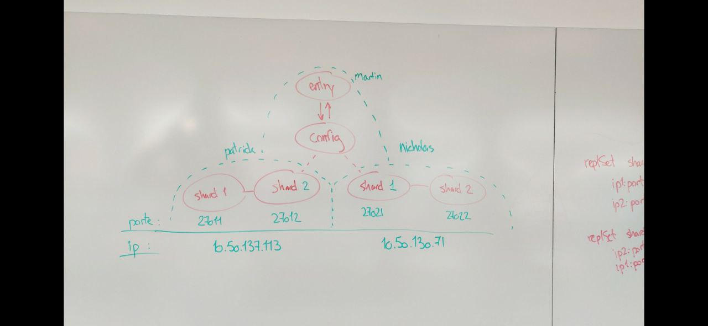
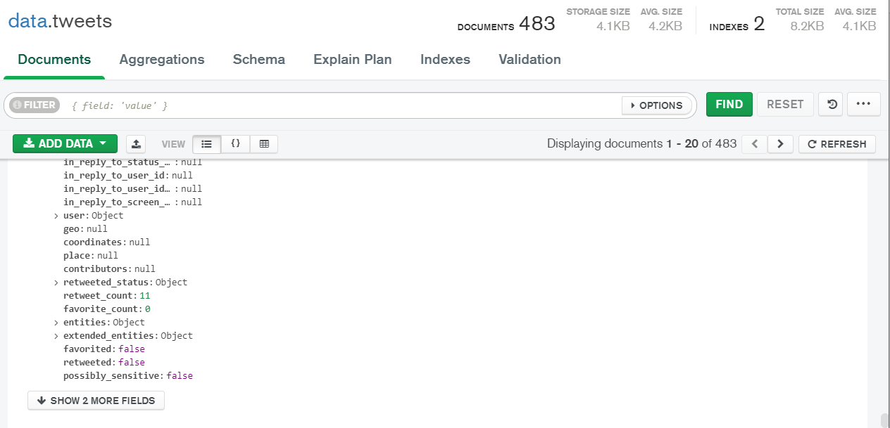

#Setup of databse sharding architecture

## Architecture diagram

The following images shows the architecture of our setup. 
As it is seen Patricks(c1) & Nicholas'(c2) computers handle the storage of shards meanwhile Martins computer(c3) handle the entry and the config file.

### Setup on the diffrent computers

***C1***

    1.  Seting up first shard server
    .\mongod --shardsvr --dbpath "<Path_to_empty_folder>" --port <port1> --bind_ip localhost,0.0.0.0 —replSet shard1

    2.  Seting up Second shard server
    .\mongod --shardsvr --dbpath "<Path_to_empty_folder>" --port <port2> --bind_ip localhost,0.0.0.0 —replSet shard2

    3. initiating and connection to 2nd shard on other computer
    rs.initiate({
        _id: 'shard1',
        members: [
        {_id: 0, host: '<patrick_ip>:<port>'},
        {_id: 1, host: '<nicholas_ip>:<port>'}
    ]})

Running a status writes the following in the terminal:

    rs.status() {
        "operationTime" : Timestamp(0, 0),
        "ok" : 0,
        "errmsg" : "no replset config has been received",
        "code" : 94,
        "codeName" : "NotYetInitialized",
        "$clusterTime" : {
            "clusterTime" : Timestamp(0, 0),
            "signature" : {
            "hash" : BinData(0,"AAAAAAAAAAAAAAAAAAAAAAAAAAA="),
            "keyId" : NumberLong(0)
            }
        }
    } 

This is beacuse computer 2 has to initiate the shards aswell after we get the following

    rs.status()
    {
        "set" : "shard2",
        "date" : ISODate("2022-03-22T11:59:04.022Z"),
        "myState" : 5,
        "term" : NumberLong(0),
        "syncSourceHost" : "10.50.130.71:27022",
        "syncSourceId" : 0,
        "heartbeatIntervalMillis" : NumberLong(2000),
        "majorityVoteCount" : 2,
        "writeMajorityCount" : 2,
        "votingMembersCount" : 2,
        "writableVotingMembersCount" : 2,
        "optimes" : {
            "lastCommittedOpTime" : {
            "ts" : Timestamp(0, 0),
            "t" : NumberLong(-1)
        },
        "lastCommittedWallTime" : ISODate("1970-01-01T00:00:00Z"),
        "appliedOpTime" : {
        "ts" : Timestamp(0, 0),
        "t" : NumberLong(-1)
        },
        "durableOpTime" : {
        "ts" : Timestamp(0, 0),
        "t" : NumberLong(-1)
        },
        "lastAppliedWallTime" : ISODate("1970-01-01T00:00:00Z"),
        "lastDurableWallTime" : ISODate("1970-01-01T00:00:00Z")
        },
        "lastStableRecoveryTimestamp" : Timestamp(0, 0),
        "initialSyncStatus" : {
            "failedInitialSyncAttempts" : 0,
            "maxFailedInitialSyncAttempts" : 10,
            "initialSyncStart" : ISODate("2022-03-22T11:58:59.006Z"),
            "initialSyncAttempts" : [ ],
            "appliedOps" : 0,
            "initialSyncOplogStart" : Timestamp(1647950337, 1),
            "initialSyncOplogEnd" : Timestamp(1647950337, 1),
            "totalTimeUnreachableMillis" : NumberLong(0),
            "databases" : {
            "databasesCloned" : 1,
            "admin" : {
            "collections" : 1,
            "clonedCollections" : 1,
            "start" : ISODate("2022-03-22T11:59:00.172Z"),
            "end" : ISODate("2022-03-22T11:59:00.285Z"),
            "elapsedMillis" : 113,
            "admin.system.version" : {
                "documentsToCopy" : 1,
                "documentsCopied" : 1,
                "indexes" : 1,
                "fetchedBatches" : 1,
                "start" : ISODate("2022-03-22T11:59:00.182Z"),
                "end" : ISODate("2022-03-22T11:59:00.285Z"),
                "elapsedMillis" : 103,
                "receivedBatches" : 1
                }
            }
        }
    },
    "members" : [
        {
        "_id" : 0,
        "name" : "10.50.130.71:27022",
        "health" : 1,
        "state" : 2,
        "stateStr" : "SECONDARY",
        "uptime" : 5,
        "optime" : {
            "ts" : Timestamp(1647950337, 1),
            "t" : NumberLong(-1)
            },
        "optimeDurable" : {
        "ts" : Timestamp(1647950337, 1),
        "t" : NumberLong(-1)
        },
        "optimeDate" : ISODate("2022-03-22T11:58:57Z"),
        "optimeDurableDate" : ISODate("2022-03-22T11:58:57Z"),
        "lastHeartbeat" : ISODate("2022-03-22T11:59:02.526Z"),
        "lastHeartbeatRecv" : ISODate("2022-03-22T11:59:03.518Z"),
        "pingMs" : NumberLong(9),
        "lastHeartbeatMessage" : "",
        "syncSourceHost" : "",
        "syncSourceId" : -1,
        "infoMessage" : "",
        "configVersion" : 1,
        "configTerm" : -1
        },
        {
        "_id" : 1,
        "name" : "10.50.137.113:27012",
        "health" : 1,
        "state" : 5,
        "stateStr" : "STARTUP2",
        "uptime" : 391,
        "optime" : {
        "ts" : Timestamp(0, 0),
        "t" : NumberLong(-1)
        },
        "optimeDate" : ISODate("1970-01-01T00:00:00Z"),
        "syncSourceHost" : "10.50.130.71:27022",
        "syncSourceId" : 0,
        "infoMessage" : "",
        "configVersion" : 1,
        "configTerm" : -1,
        "self" : true,
        "lastHeartbeatMessage" : ""
        }],

        "ok" : 1,
            "$clusterTime" : {
            "clusterTime" : Timestamp(1647950337, 1),
            "signature" : {
            "hash" : BinData(0,"AAAAAAAAAAAAAAAAAAAAAAAAAAA="),
            "keyId" : NumberLong(0)
            }
        },
        "operationTime" : Timestamp(0, 0)
    }

***C2***

    1. Seting up first shard server
    .\mongod --shardsvr --dbpath "<Path_to_empty_folder>" --port <port1> --bind_ip localhost,0.0.0.0 —replSet shard1
    
    2.  Seting up second shard server
    .\mongod --shardsvr --dbpath "<Path_to_empty_folder>" --port <port2> --bind_ip localhost,0.0.0.0 —replSet shard2
    
    3.  initiating and connection to 2nd shard on other computer
    rs.initiate({
        _id: 'shard1',
        members: [
        {_id: 0, host: '<nicholas_ip>:<port>'},
        {_id: 1, host: '<patrick_ip>:<port>'}
    ]})

***C1***

    1. Adding first shard
    sh.addShard("shard1/10.50.137.113:27011,10.50.130.71:27021")
    
    {
        shardAdded: 'shard1',
        ok: 1,
        operationTime: Timestamp({ t: 1647951361, i: 6 }),
        '$clusterTime': {
        clusterTime: Timestamp({ t: 1647951361, i: 6 }),
            signature: {
                hash: Binary(Buffer.from("0000000000000000000000000000000000000000", "hex"), 0),
                keyId: Long("0")
            }
        }
    }
    
    2. Adding second shard
    sh.addShard("shard2/10.50.130.71:27022,10.50.137.113:27012")
    {
        shardAdded: 'shard2',
        ok: 1,
        operationTime: Timestamp({ t: 1647951399, i: 5 }),
        '$clusterTime': {
        clusterTime: Timestamp({ t: 1647951399, i: 5 }),
        signature: {
            hash: Binary(Buffer.from("0000000000000000000000000000000000000000", "hex"), 0),
            keyId: Long("0")
            }
        }
    }

### Data insertion in other dbs

    

    2. Data from shard 1
    
    shard1:PRIMARY> show dbs
    admin   0.000GB
    config  0.001GB
    data    0.001GB
    local   0.001GB
    
    shard1:PRIMARY> use data
    switched to db data
    
    shard1:PRIMARY> db.tweets.count()
    483
    shard1:PRIMARY>

    2. Data from shard 2

    

