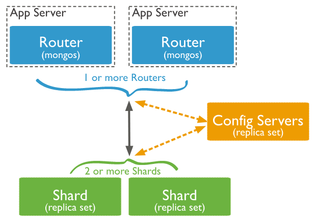
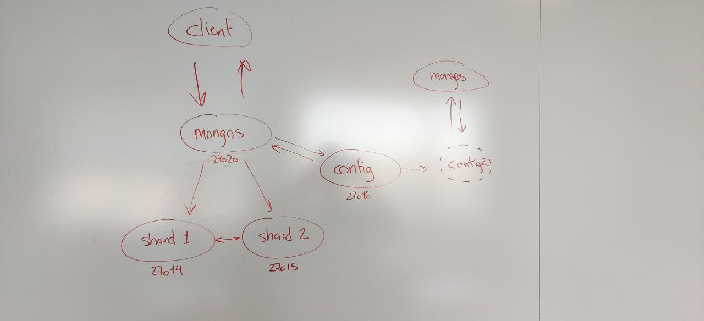

# MongoDB Assignment 3 - Questions to be answered

### What is sharding in mongoDB?

Sharding is a method for distributing data across multiple machines. MongoDB uses sharding to support deployments with very large data sets and high throughput operations.

Database systems with large data sets or high throughput applications can challenge the capacity of a single server.
There are two methods for addressing system growth: ***vertical*** and ***horizontal*** scaling.

***Vertical Scaling:*** increasing the capacity of a single server, such as using a more powerful CPU, more RAM or faster storage.

*Note:*\
*There is a practical maximum for vertical scaling.*

***Horizontal Scalin:*** dividing the system dataset and load over multiple servers, adding additional servers to increase capacity as required.

*Note:*\
*Complexity increased in infrastructure and maintenance for the deployment.*

### What are the different components required to implement sharding?

A MongoDB **sharded cluster** consists of the following components:

***shard:*** Each shard contains a subset of the sharded data. Each shard can be deployed as a replica set.  

***replica set(Optinal):*** A cluster of MongoDB servers that implements replication and automated failover. 

***mongos:*** The mongos acts as a query router, providing an interface between client applications and the sharded cluster.

***config servers:*** Config servers store metadata and configuration settings for the cluster.

### Explain architecture of sharding in mongoDB?

***Mongos*** Handles the communication with the client and connects the client to multiple sharded servers.

***ConfigSet*** When a Client sends data to a mongos server, the configServer checks if the requestet command is correct & what shard the command goes to.

An exstended version with multiple mongos server can look like this:

### Provide implementation of map and reduce function and execution command for running MapReduce.

    var map=function(){ emit(this.age,this.rank)};
    var reduce=function(age,rank){ return Array.sum(rank);};
    db.employee.mapReduce(map,reduce,{out :"resultCollection1"});

    db.collection.mapReduce(
    function() {emit(key,value);},  // map function
    function(key,values) {return reduceFunction},  // reduce function
    { out: collection }
    )

***Example:***  

DataSet

    db.students.find({});
    { "_id" : ObjectId("5a1f9ce431c157f3ec2aec39"), "name" : "Midhu", "subject" : "science", "marks" : 68 }
    { "_id" : ObjectId("5a1f9ce431c157f3ec2aec3a"), "name" : "Midhu", "subject" : "maths", "marks" : 98 }
    { "_id" : ObjectId("5a1f9ce431c157f3ec2aec3b"), "name" : "Midhu", "subject" : "sports", "marks" : 77 }
    { "_id" : ObjectId("5a1f9ce431c157f3ec2aec3c"), "name" : "Akhil", "subject" : "science", "marks" : 67 }
    { "_id" : ObjectId("5a1f9ce431c157f3ec2aec3d"), "name" : "Akhil", "subject" : "maths", "marks" : 87 }
    { "_id" : ObjectId("5a1f9ce431c157f3ec2aec3e"), "name" : "Akhil", "subject" : "sports", "marks" : 89 }
    { "_id" : ObjectId("5a1f9ce431c157f3ec2aec3f"), "name" : "Anish", "subject" : "science", "marks" : 67 }
    { "_id" : ObjectId("5a1f9ce431c157f3ec2aec40"), "name" : "Anish", "subject" : "maths", "marks" : 78 }
    { "_id" : ObjectId("5a1f9ce431c157f3ec2aec41"), "name" : "Anish", "subject" : "sports", "marks" : 90 }

Step 1: Prepare Map function  

    var map = function() {emit(this.name,this.marks);};

Step 2: Prepare Reduce function

    var reduce = function(name,marks) {return Array.sum(marks);};

Step 3: Prepare mapReduce function

       db.students.mapReduce(
        map,
        reduce,
        {  out: "totals" }
       );

Step 4: Start Mongo Daemon

    sudo mongod --port 27017 --dbpath /var/lib/mongodb 

Step 5: Run mapReduce

The value has been accumulated (aggregated) for the key values and the output is written to totals collection.

    > var map = function() {emit(this.name,this.marks);};
    > var reduce = function(name,marks) {return Array.sum(marks);};
    > db.students.mapReduce(
           map,
           reduce,
           {  out: "totals" }
       );
    {
    "result" : "totals",
    "timeMillis" : 599,
    "counts" : {
    "input" : 9,
    "emit" : 9,
    "reduce" : 3,
    "output" : 3
    },
    "ok" : 1
    }

    > db.totals.find({})
    { "_id" : "Akhil", "value" : 243 }
    { "_id" : "Anish", "value" : 235 }
    { "_id" : "Midhu", "value" : 243 }

### Provide top 10 recorded out of the sorted result.

    { "_id" : "Akhil", "value" : 243 }
    { "_id" : "Anish", "value" : 235 }
    { "_id" : "Midhu", "value" : 243 }

### Provide top 10 recorded out of the sorted result. We used aggregate

    db.tweets.aggregate({$sort:{"_id":-1}}, 
    {$match: {"entities.hashtags.text":{$exists:true}}},
    {$limit:1000},{$unwind:"$entities.hashtags"},
    {$project : {"entities.hashtags.text":1,"_id":1}},
    {$group:{"_id":{$toLower:"$entities.hashtags.text"},
    count : { $sum : 1 }}}, {$sort:{"count":-1}}, {$limit:10})

Output:
    
    { _id: 'angularjs', count: 29 }
    { _id: 'nodejs', count: 29 }
    { _id: 'fcblive', count: 27 }
    { _id: 'javascript', count: 22 }
    { _id: 'lfc', count: 19 }
    { _id: 'globalmoms', count: 19 }
    { _id: 'webinar', count: 18 }
    { _id: 'espanyolfcb', count: 18 }
    { _id: 'iwci', count: 17 }
    { _id: 'job', count: 13 }
